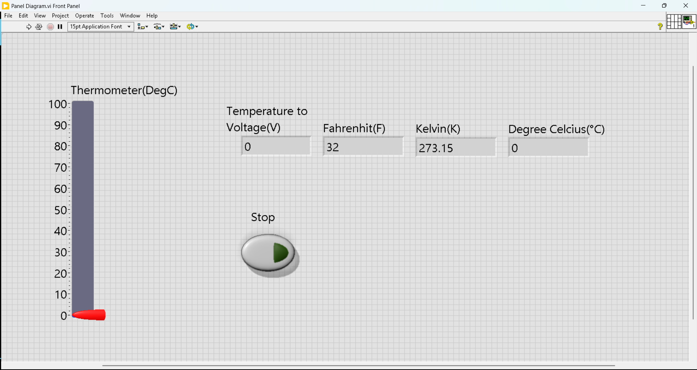
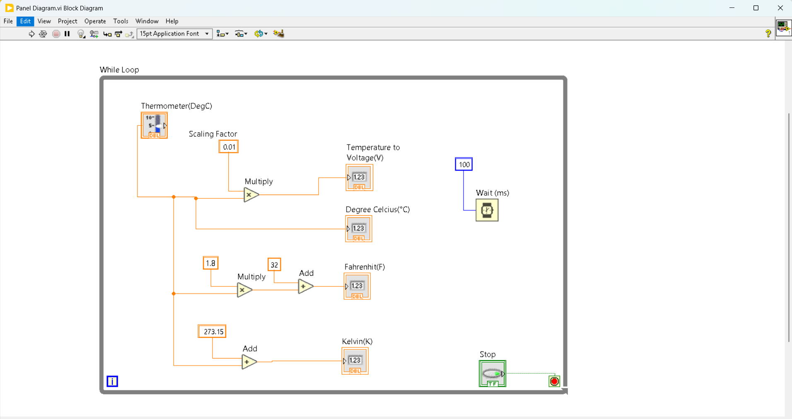

# 🌡️ Temperature Monitor (LabVIEW + Python)

## 📌 Description
This project implements a Temperature Monitoring System in LabVIEW and automates VI execution using Python (VI Server COM interface).  
The VI displays temperature using a thermometer and converts it into multiple units like Celsius, Fahrenheit, Kelvin, and Voltage.

## 🚀 Features
- Real-time temperature visualization (Thermometer UI)
- Multi-unit conversion (°C, °F, K, Voltage)
- Python-based VI control
- Automation using COM (pywin32)
- Continuous temperature updates

## 🛠️ Tools Used
- LabVIEW
- Python
- pywin32
- Visual Studio Code

## 📸 Screenshots

### Front Panel

### Block Diagram

⚠️ Requirements
LabVIEW installed
Python 3.x
Install dependency:

pip install pywin32

🎥 Demo

Coming soon...

👨‍💻 Author

Adesh Patil